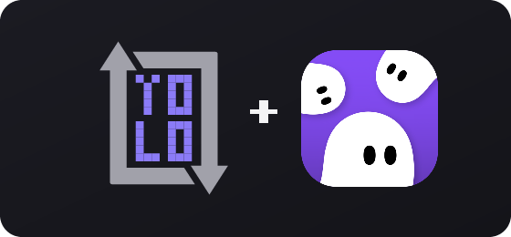
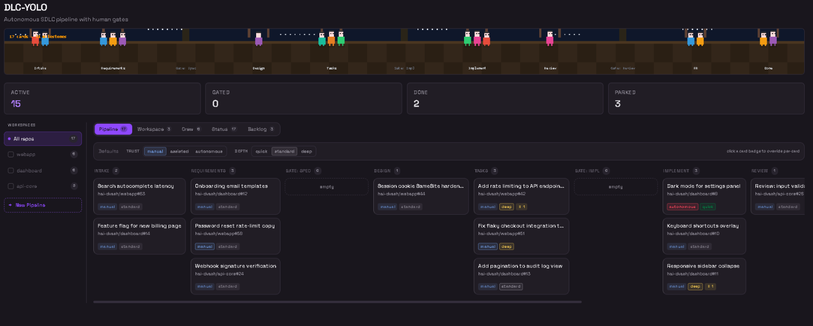
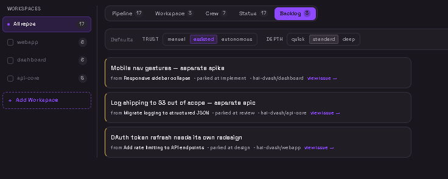

<p align="center">
  
</p>

# DLC-YOLO

**Autonomous software development lifecycle, as a KiroCrew app.** Issues flow through a
spec → design → build → review → PR pipeline driven by specialist agents — with human
gates where you want control and full autonomy where you don't, and pipelines you can
shape step by step.



The pipeline graph across the top shows each stage as a node — circles for agent steps,
diamonds for human gates. Nodes **glow in proportion to how many cards sit in that
stage**, so the board's center of gravity is visible at a glance. A left rail switches
between pipelines/workspaces; the kanban below groups the work.

---

## First-class pipelines

A **pipeline** is the top-level unit of work — one per repo/workspace, created from the
**Pipeline Setup** modal, owning the cards that flow through it. It exists even with zero
cards and holds the defaults its cards inherit.

Pipelines own their **own ordered steps** — there is no fixed stage list. Each step is
either:

- a **gate** — a human approval point, or
- an **agent step** — runs work under an agent config (name, role/prompt, tools, model).

Steps are reorderable, renamable, and add/removable in the setup modal. The built-in
spec → design → tasks → implement → review → PR ladder is just the default the wizard
seeds from.

### Agent setup panel + `✨ Draft with /dlc-yolo`

Configuring an agent step opens an inline **agent setup panel** in the same modal: reuse
an existing agent, or set name / role / tools / model. For a genuinely new agent, the
panel's **✨ Draft with /dlc-yolo** button launches a real chat session (via the SDK chat
launcher) that designs the agent with you conversationally and writes it back into the
step.

---

## Operation modes

Three orthogonal axes. Each has a pipeline-wide default; a pipeline, a **step**, or a card
can override it. Resolution cascades **card → step → pipeline → global**.

### Trust — how much autonomy before pausing for a human
| Level | Behavior |
|-------|----------|
| `manual` | Confirm every trigger **and** stop at all gates |
| `assisted` *(default)* | Auto-run agent steps, stop at human gates |
| `autonomous` | Auto-approve gates, auto-pick triggers, pause only on a blocker or Critical/High finding |

### Depth — how thoroughly each step runs
| Level | Behavior | Spec type |
|-------|----------|-----------|
| `quick` | Requirements + tasks, skip design; Critical-only review | `quick` |
| `standard` *(default)* | Full requirements → design → tasks; normal review | `feature` |
| `deep` | Exhaustive design, adversarial review, extra test coverage | `feature` (deep) |

Per-step overrides mean "this step runs autonomous + deep, that gate stays manual."

### Backlog — parked ideas that can't be spec'd now

When an agent hits a tangent it can't spec right now, it **parks** the idea instead of
blocking: the orchestrator files a GitHub issue labeled `dlc-backlog` on the card's owned
repo and records it on the card. A back-feed cron pulls open `dlc-backlog` issues back in
as fresh intake cards.



---

## Effort & scope-aware back-stepping

The spec agent attributes **effort** (T-shirt points) to each spec. When a step outgrows
the scope of the step before it (beyond a depth-tuned factor), the pipeline proposes a
**back-step** a level down — implement → design ("this became a design ticket"), design →
requirements ("re-spec smaller") — or parks the single over-scoped feature to the backlog.
Cards surface an ⚡ effort badge and a ↩ back-step badge.

*(Predictive token-budgeting is designed but parked; the scope-growth heuristic ships and
needs no history.)*

---

## GitHub as the source of truth

A card's stage is a `dlc:<step>` **label** on its GitHub issue. Advancing/rejecting moves
the label; external tools (or a human relabeling on GitHub) can move a card. If `gh`/the
repo is unavailable, a pipeline runs **local-only** and **re-syncs to GitHub** when access
returns. `state.json` holds the rich data; GitHub holds the stage.

---

## The `/dlc-yolo` command

`/dlc-yolo` turns a chat session into a pipeline driver:

1. **Start a new pipeline conversation** — spec anything, file it to GitHub as an issue,
   label it, and record a card the local pipeline triggers off.
2. **Maintain an existing pipeline** — read a card's stage from its label and drive the
   next step (answer a gate, re-trigger a phase, park, back-step).
3. **Author an agent for a custom step** — design a new step agent conversationally and
   write it into the pipeline (this is where the panel's Draft button hands off).

---

## Phase triggers

When a card enters an agent step, the orchestrator asks how to run it, then records the
choice so it never re-asks:

- **requirements / design / tasks** → *Trigger Spec Builder* (native `spec-workflow`
  skill) · *Handle inline* · *Skip*
- **implement** → *Trigger Task Runner* (native `task_run`) · *Handle inline* · *Skip*

Under `autonomous` trust the orchestrator auto-picks the recommended trigger.

---

## Per-repo sandbox

Independently of trust mode, **every pipeline agent is strictly confined to the single
repository its card owns** (`source.repo`). Specialist and Spec-Builder / Task-Runner
subagents are seeded with exactly one `WORKING_DIR` and one `SPEC_DIR`; only the
orchestrator touches shared pipeline state. Trust governs *when to pause*; the sandbox
governs *where an agent may act*, always.

---

## Architecture

No backend process. The UI reads/writes pipeline state through the gateway's file API —
`GET /api/file-read?path=…` and `POST /api/file-write` — against `/tmp/dlc-yolo/state.json`
(using the SDK's `api.get()` / `api.post()`). Two crons drive agents; specialist work goes
through `spawn_run` / `task_run`.

Native KiroCrew APIs used: `ask_question`, `spawn_run`, `task_run`, `send_message`,
scheduled crons, `/api/file-read` + `/api/file-write`, the SDK chat launcher
(`useChatLauncher`), and `gh` for issues/labels/backlog. The Pipeline Setup modal reads
**Issue Radar**'s connected repos (read-only) as pipeline candidates.

### State shape

```jsonc
{
  "config": { "trust": "assisted", "depth": "standard" },   // global defaults
  "pipelines": [
    {
      "id": "pl-…", "repo": "owner/name", "workspace": "default",
      "source": "issue-radar", "sot": "github",
      "trust": "assisted", "depth": "standard", "backlog_intake": true,
      "steps": [
        { "id": "requirements", "name": "Requirements", "type": "agent",
          "agent": { "name": "spec-agent", "role": "…", "tools": ["ask_question"] },
          "trust": "assisted", "depth": "standard", "label": "dlc:requirements" },
        { "id": "gate-spec", "name": "Gate: Spec", "type": "gate", "label": "dlc:gate-spec" }
      ]
    }
  ],
  "cards": [
    {
      "id": "…", "title": "…", "stage": "design", "pipeline_id": "pl-…", "sot": "github",
      "trust": "deep", "depth": "deep",
      "source": { "type": "github", "repo": "owner/name", "issue": 42, "url": "…" },
      "effort": { "total": 8, "scope": { "requirements": 8, "design": 9 } },
      "backstep_history": [ … ], "parked": [ … ],
      "artifacts": { … }, "gate_history": [ … ], "trigger_history": [ … ], "history": [ … ]
    }
  ]
}
```

### Crons

| Cron | Interval | Role |
|------|----------|------|
| `dlc-yolo-advance` | 120s | Walk each pipeline's own steps, honor per-step trust/depth, fire triggers, move `dlc:<step>` labels |
| `dlc-yolo-backlog-intake` | 900s | Back-feed open `dlc-backlog` issues as new intake cards (read + create only) |

---

## UI

- **Pipeline graph** — glowing, count-correlated nodes (circles = agent steps, diamonds = gates); click a node to scroll to its column
- **Workspace rail** — multi-select repos to view several pipelines combined, plus **+ New Pipeline**
- **Pipeline Setup modal** — pick a repo (Issue Radar / KiroCrew workspace / manual), set trust/depth/backlog-intake, and edit custom steps with an inline agent setup panel
- **Views** — Pipeline (by step) · Workspace (by repo) · Crew (by agent) · Status (blocked/in-flight/done) · Backlog (parked ideas)
- **Mode pills** — click a card's trust/depth to override; ⚡ effort and ↩ back-step badges; theme-aware (adapts to the active dashboard theme)

---

## Installation

```bash
cd ui && npm install --legacy-peer-deps && npx vite build   # outputs to ui/dist/ (served at /apps/dlc-yolo/ui/dist/index.mjs)
cp crons/dlc_yolo_advance.py ~/.kiro/crew/crons/   # deploy the advance loop
kirocrew app install /path/to/kiro-crew-yolo-dlc
kirocrew app enable dlc-yolo
```

## Development

```bash
kirocrew app dev dlc-yolo          # hot-reload the app
cd ui && npx vite build            # rebuild the UI bundle
```

## Structure

```
kiro-crew-yolo-dlc/
├── app.json                          ← manifest (agents, skills, crons, permissions)
├── agents/
│   ├── pipeline-orchestrator.json    ← steps, triggers, gates, back-step, GH labels, backlog
│   ├── spec-agent.json               ← requirements + effort attribution
│   ├── design-agent.json             ← design
│   ├── impl-agent.json               ← task breakdown + implementation
│   └── review-agent.json             ← code review
├── skills/
│   ├── pipeline-workflow/SKILL.md    ← pipelines, steps, modes, sandbox, backlog, SoT, effort
│   └── dlc-yolo/SKILL.md             ← the /dlc-yolo command
├── crons/
│   └── dlc_yolo_advance.py           ← zero-token deterministic advance loop (deployed to ~/.kiro/crew/crons/)
├── ui/
│   ├── src/App.tsx                   ← kanban, graph, setup modal, agent panel (@kirocrew/app-sdk)
│   └── vite.config.ts
├── docs/                             ← screenshots
└── README.md
```

---

## License

Apache License 2.0 © 2026 hai-dvash

*DLC-YOLO is an independent, community-built extension for the KiroCrew agent platform.
It is not affiliated with, endorsed by, or an official product of KiroCrew. "KiroCrew"
and related names are the property of their respective owners; they are referenced here
only to describe the platform this app runs on. DLC-YOLO bundles no KiroCrew source — it
links against the public `@kirocrew/app-sdk` at runtime.*
